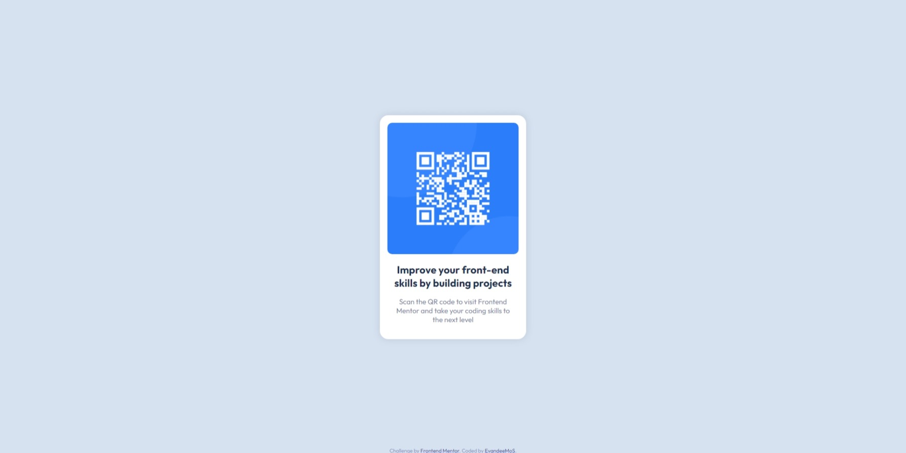

# Frontend Mentor - QR code component

Olá. Essa é a minha solução para o desafio: [QR code component challenge on Frontend Mentor](https://www.frontendmentor.io/challenges/qr-code-component-iux_sIO_H).

O Frontend Mentor é um site onde você pode praticar suas habilidades de codificação desenvolvendo projetos realistas.

## Sumário

- [Frontend Mentor - QR code component](#frontend-mentor---qr-code-component)
  - [Sumário](#sumário)
  - [visão geral](#visão-geral)
    - [Screenshots](#screenshots)
    - [Links](#links)
  - [Meu processo](#meu-processo)
    - [Feito com](#feito-com)
    - [Decisões](#decisões)
  - [Author](#author)

## Visão geral

### Screenshots

  
desktop view

  

  
Mobile view

  

### Links

- Solution URL: https://github.com/EvandeeMoS/qr-code-component
- Live Site URL: https://evandeemos.github.io/qr-code-component/

## Meu processo

### Feito com

- Semantic HTML5 markup
- CSS positioning
- Mobile-first workflow

### Decisões

Primeiramente tomei a decisão de fazer o projeto seguindo o modelo mobile-first, fiz essa escolha pois ao ver a página, pensei que a mesma se encaixaria melhor numa interface mobile, a versão para desktop me pareceu um pouco vazia.

Então fiz alguns planos sobre como seria o fluxo de desenvolvimento da página, quais seriam as tags necessarias para cada elemento em tela, quais seriam as classes necessárias para estilizar a página, etc... Isso fez com que o desenvolver da página tenha sido bem mais rápido do que eu pensava.

Eu decidi fazer o projeto usando apenas o que eu já sabia sobre HTML e CSS, tendo isso em mente, dei preferência a posicionar o elementos em tela utilizando a propriedade _position_ do CSS em vez dos modelo _grid_ ou _flexbox_, visto que a página possui apenas um elemento centralizado na tela, não há riscos diretos da página quebrar com o uso de _position_, sendo uma solução simples e eficaz para centralizar o elemento em tela.

Sobre a resposibilidade da página, bem, eu não fiz nenhuma alteração entre o layout desktop e mobile, visto que, de acordo com o desafio a visão desktop e mobile são exatamente iguais, sendo assim a propriedade _position_ já fez o trabalho de posicionar o elemento no meio da tela em ambos as visões.

## Author

- Frontend Mentor - [@EvandeeMoS](https://www.frontendmentor.io/profile/EvandeeMoS)
