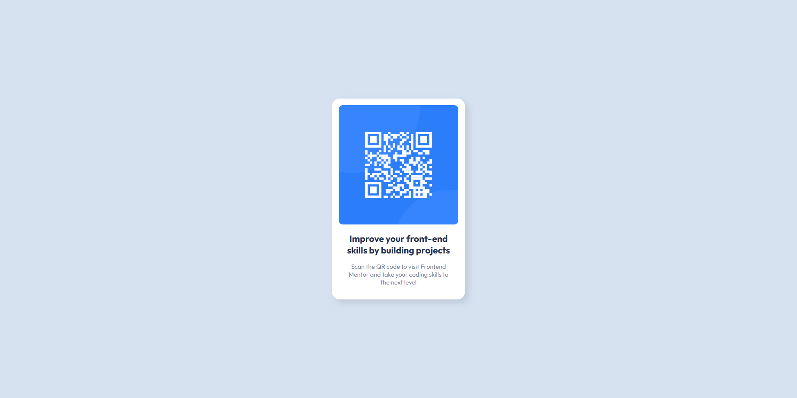

# Frontend Mentor - QR code component

Olá. Essa é a minha solução para o desafio: [QR code component challenge on Frontend Mentor](https://www.frontendmentor.io/challenges/qr-code-component-iux_sIO_H).

O Frontend Mentor é um site onde você pode praticar suas habilidades de codificação desenvolvendo projetos realistas.

## Sumário

- [Frontend Mentor - QR code component](#frontend-mentor---qr-code-component)
  - [Sumário](#sumário)
  - [visão geral](#visão-geral)
    - [Screenshots](#screenshots)
    - [Links](#links)
  - [Meu processo](#meu-processo)
    - [Feito com](#feito-com)
    - [Decisões](#decisões)
  - [Author](#author)

## Visão geral

### Screenshots

<details open>
  <summary>desktop view</summary>
  
</details>

<details>
  <summary>Mobile view</summary>
  
</details>

### Links

- Solution URL: https://github.com/EvandeeMoS/qr-code-component
- Live Site URL: https://evandeemos.github.io/qr-code-component/

## Meu processo

### Feito com

- Semantic HTML5 markup
- CSS positioning
- Mobile-first workflow

### Decisões

Primeiramente tomei a decisão de fazer o projeto seguindo o modelo mobile-first, fiz essa escolha pois ao ver a página, pensei que a mesma se encaixaria melhor numa interface mobile, a versão para desktop me pareceu um pouco vazia.

Então fiz alguns planos sobre como seria o fluxo de desenvolvimento da página, quais seriam as tags necessarias para cada elemento em tela, quais seriam as classes necessárias para estilizar a página, etc... Isso fez com que o desenvolver da página tenha sido bem mais rápido do que eu pensava.


<details>
<summary>Versões antigas</summary>
<p>Eu decidi fazer o projeto usando apenas o que eu já sabia sobre HTML e CSS, tendo isso em mente, dei preferência a posicionar o elementos em tela utilizando a propriedade _position_ do CSS em vez dos modelo _grid_ ou _flexbox_, visto que a página possui apenas um elemento centralizado na tela, não há riscos diretos da página quebrar com o uso de _position_, sendo uma solução simples e eficaz para centralizar o elemento em tela.</p>

<p>Sobre a resposibilidade da página, bem, eu não fiz nenhuma alteração entre o layout desktop e mobile, visto que, de acordo com o desafio a visão desktop e mobile são exatamente iguais, sendo assim a propriedade _position_ já fez o trabalho de posicionar o elemento no meio da tela em ambos as visões.</p>

</details>

### Updates after challenge

Após receber algumasa sugestões do pessoal lá do frontend mentor, eu decidi rever algumas das minhas decisões e com isso melhorar responsabilidde e a acessibilidade da minha página.

Primeiramente, eu tinha feito o erro de pular um nível das tags de título, então nesse update eu decidi ajustar isso.

- Antes

  ```html
  <h2 class="card-title">Improve your front-end skills by building projects</h2>
  ```

- Depois

  ```html
  <h1 class="card-title">Improve your front-end skills by building projects</h1>
  ```

Eu também decidi colocar a atribução dentro de um footer, para manter o projeto mais organizado tanto no código quanto para os leitores de tela.

```html
<footer>
  <div class="attribution">
    <p>
      Challenge by <a href="https://www.frontendmentor.io?ref=challenge" target="_blank">Frontend Mentor</a>. 
      Coded by <a target="_blank" href="https://github.com/EvandeeMoS">EvandeeMoS</a>.
    </p>
  </div>
</footer>
```

Já no Css, decidi largar minha antiga decisão de utilizar o _css position_ invés do _css grid layout_, antes havia pensado no position como uma forma rápida de entregar algo simples, mas o grid layout se prova mais eficaz para possíveis adições futuras.

```css
body {
  min-height: 100vh;

  display: grid;
  
  grid-template-rows: 100vh auto;
  place-items: center;

  background-color: #d6e2f0;
  font-family: 'Outfit', sans-serif;

  font-size: 1.5rem;
}
```

E para finalizar, eu troquei as unidades que estavam sendo usadas no css por unidadades responsivas, agora a página irá se adptar ao tamanho de fonte definida em seu navegador. Algumas das alterações podem ser vistas nessas linhas de código:

- Essa foi uma dica que eu peguei num blog a um tempo atrás, onde nós ajustamos o tamanho da fonte base para 10px em vez de 16px, facilitando o cálculo de font-size usando em e rem.
  ```css
  html {
      font-size: 0.625rem;
  }
  ```

- Tamanho base da fonte do site definida para 15px
  ```css
  body {
    font-size: 1.5rem;
  }
  ```

- Mudando o tamanho do título do cartão para dar um destaque
  
  ```css
  .card-title {
    margin: 1.6rem;
    font-size: 1.46em;
    color: #1f3251;
  }
  ```

## Author

- Frontend Mentor - [@EvandeeMoS](https://www.frontendmentor.io/profile/EvandeeMoS)
