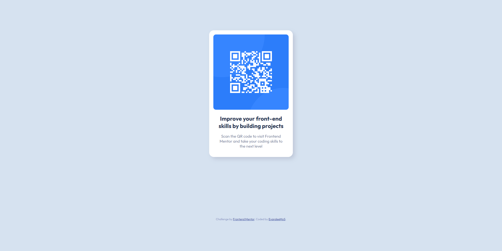
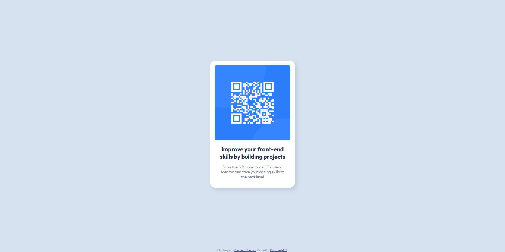

# Frontend Mentor - QR code component

PT-BR README: [:brazil:](README-pt-br.md)

Hi there! This is my solution to: [QR code component challenge on Frontend Mentor](https://www.frontendmentor.io/challenges/qr-code-component-iux_sIO_H). 

Frontend Mentor is a plataform with a lot of challenges to help you improve your coding skills building realistic projects. 

## Table of contents

- [Frontend Mentor - QR code component](#frontend-mentor---qr-code-component)
  - [Table of contents](#table-of-contents)
  - [Overview](#overview)
    - [Screenshots](#screenshots)
    - [Links](#links)
  - [My process](#my-process)
    - [Built with](#built-with)
    - [Decisions](#decisions)
    - [Updates After Challenge](#updates-after-challenge)
  - [Author](#author)
  - [Acknowledgments](#acknowledgments)

**Note: Delete this note and update the table of contents based on what sections you keep.**

## Overview

It's a simple page of a card with a qr-code in it, similar page are used to an infinity of things, since redirect people to another pages to make payments reading the qr-code.

### Screenshots

<details open>
  <summary>desktop view</summary>
  
</details>

<details>
  <summary>Mobile view</summary>
  
</details>

### Links

- Solution URL: https://github.com/EvandeeMoS/qr-code-component
- Live Site URL: https://evandeemos.github.io/qr-code-component/

## My process

### Built with

- Semantic HTML5 markup
- CSS grid layout
- Mobile-first workflow

### Decisions


I took the desicion to use Mobile-first workflow, it was because I think this type of page applies better into mobile than desktop, I think it's look a little empty into the desktop version.

I made some plans about how I would apply things and then I just needed to implement it, it made the code flow a lot faster than I tought.

<details>
<summary>old versions</summary>
I made this page using just what I already knew about CSS and HTML, based on that, you will see that I took the decision to use CSS position properties instead of CSS grid or flex layout, why that? Well, how it's just and element on the entire body of the site, I tought that it would fit well, a simple way to put things into place, and how it's just one element, I don't need to worry about breaking the layout.

About the responsible part of the page, well, I didn't needed to make any change into the layout to the desktop version, cause the position propertiers already do the job to put the things on place based on view size.
</details>

### Updates after challenge

After some recieve some suggestions from frontend mentor community, I decided change some off my initial decisions to make it more responsible and improve acessibility of my page.

First of all, I made the mistake of skipping one header level, so now it's corrected.

- before

  ```html
  <h2 class="card-title">Improve your front-end skills by building projects</h2>
  ```

- after

  ```html
  <h1 class="card-title">Improve your front-end skills by building projects</h1>
  ```

Then I added a tag _footer_ to wrap my atribution.

```html
<footer>
    <div class="attribution">
      <p>
        Challenge by <a href="https://www.frontendmentor.io?ref=challenge" target="_blank">Frontend Mentor</a>. 
        Coded by <a target="_blank" href="https://github.com/EvandeeMoS">EvandeeMoS</a>.
      </p>
    </div>
  </footer>
```

On CSS my decision of use _css position_ to use the _css grid layout_, as it was the principal property to put my elements into place, it was the "biggest" change into the code.

So I put the _display: grid_ property into body, but it made my footer a little bigger than needed, making the main section smaller, after some search I found the _grid-template-rows_ property, it was exactly what I wanted.

<details>
  <summary>without <em>grid-template-rows</em></summary>

  ```css
    body {
    min-height: 100vh;

    display: grid;
    place-items: center;

    background-color: #d6e2f0;
    font-family: 'Outfit', sans-serif;

    font-size: 1.5rem;
    }
  ```

  
</details>

<details>
  <summary>with</summary>

  ```css
    body {
      min-height: 100vh;

      display: grid;
      grid-template-rows: 1fr auto;
      place-items: center;

      background-color: #d6e2f0;
      font-family: 'Outfit', sans-serif;

      font-size: 1.5rem;
    }
  ```
  
  
</details>

To finish, I changed the units used in css to responsive ones, now it's responsive to change of base browser font-size changes. As you can see in these parts of code for example:

- This is a tip that from a video, make the font-size base 10px instead of 16px so it's easier think of sizes.
  ```css
  html {
      font-size: 0.625rem;
  }
  ```

- Base font-sized defined
  ```css
  body {
    font-size: 1.5rem;
  }
  ```

- Changed font-size to card titles
  
  ```css
  .card-title {
    margin: 1.6rem;
    font-size: 1.46em;
    color: #1f3251;
  }
  ```
## Author

- Frontend Mentor - [@EvandeeMoS](https://www.frontendmentor.io/profile/EvandeeMoS)

## Acknowledgments

Here some fellows of frontend mentor that helped with their suggestions into comments of my solution:
[@Hassiai](https://www.frontendmentor.io/profile/Hassiai), [@ecemgo](https://www.frontendmentor.io/profile/ecemgo) and [@sumanth-chandana](https://www.frontendmentor.io/profile/sumanth-chandana)